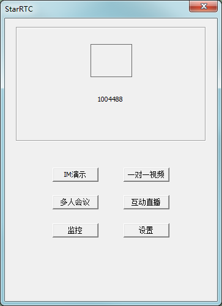
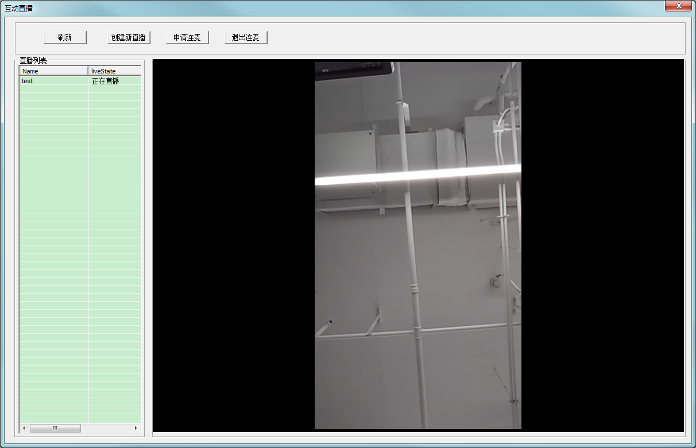

# starrtc windows示例程序

本产品完全免费，并且提供免费的私有部署服务端程序，支持全部功能，并提供第三方拉流、推流功能。

需要我们支持请加QQ群：807242783

如需私有部署，请到如下地址下载：

https://github.com/starrtc/starrtc-server

示例程序请运行release目录里面的starrtcdemo.exe

工程所在目录：starrtcdemo\starrtcdemo.sln

已实现im单聊，聊天室，群组；视频监控，voip，互动连麦直播，多人视频会议；

本示例程序可以与[其它端示例程序](https://docs.starrtc.com/en/download/)互连互通。

开发集成
====
头文件 third\starrtccoredll
动态库 release\starrtc-demo

IM
====

VOIP视频通话
====

多人会议
====

互动直播
====

监控
====

Contact
=====
QQ ： 2162498688

邮箱：<a href="mailto:support@starRTC.com">support@starRTC.com</a>

手机: 186-1294-6552

微信：starRTC

QQ群：807242783
