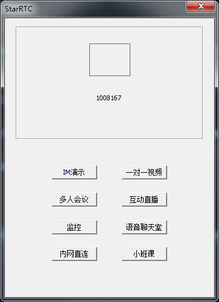
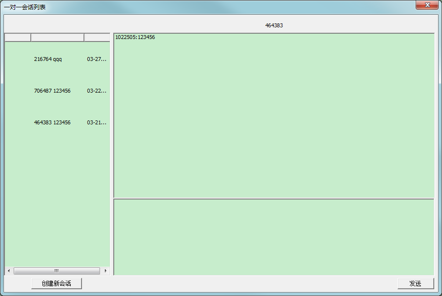
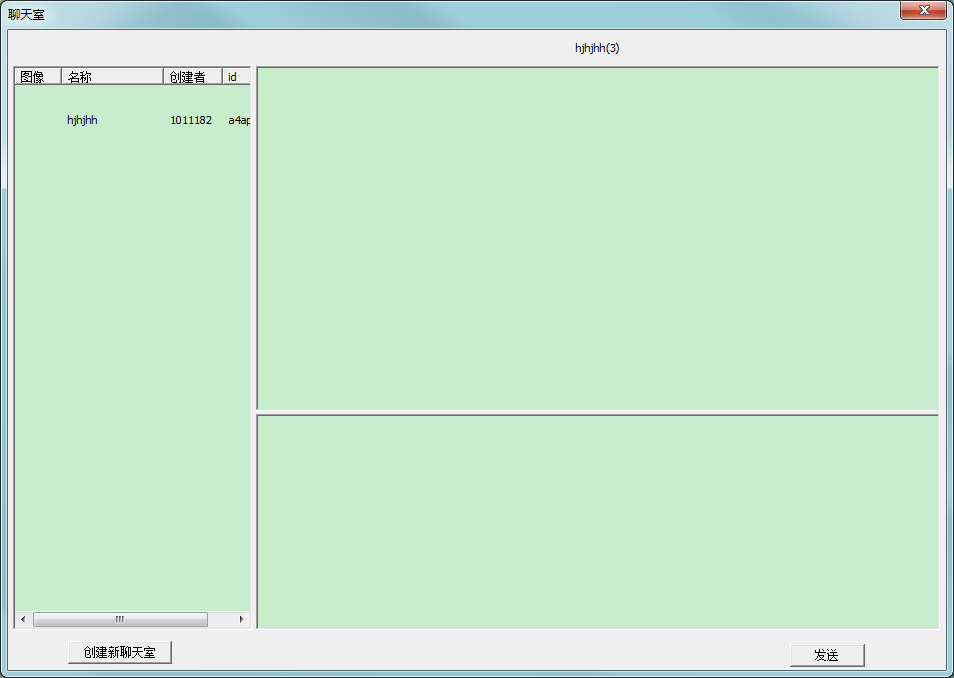
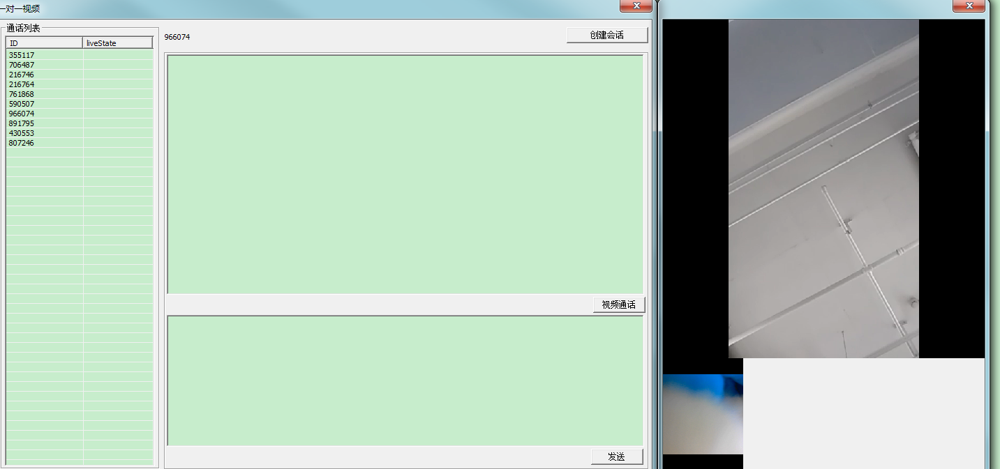
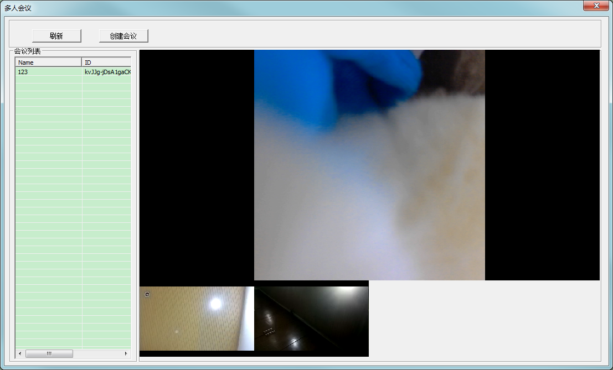
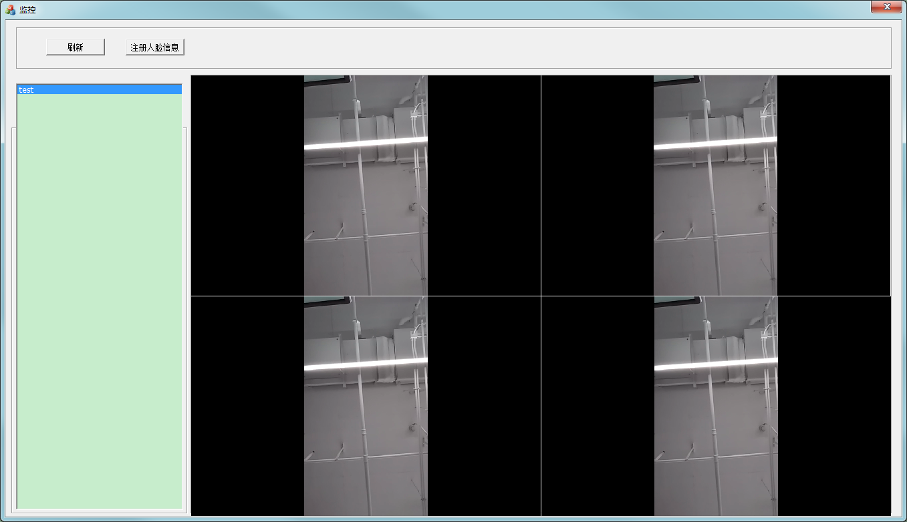
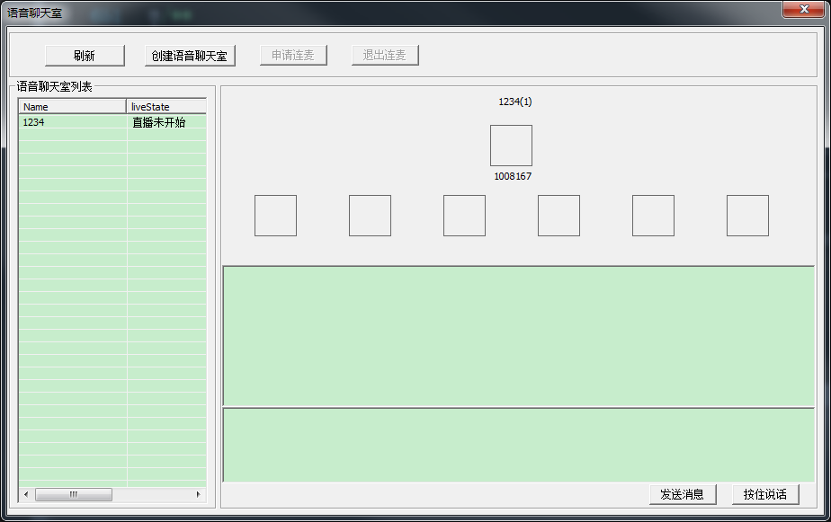
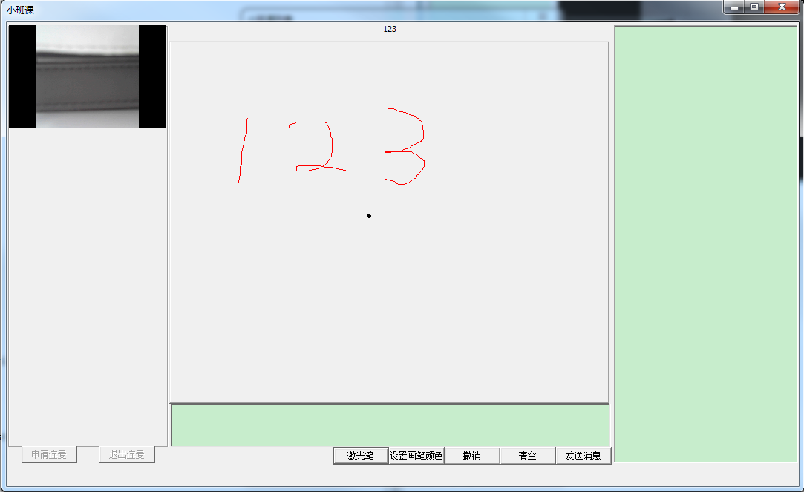

# starrtc windows demo

This product is free completely and provides a free private deployment server program that supports all features .
and it provides push and pull third-party stream.

Support
====
QQ Group ID:807242783

Please download at the following address for private deployment:

https://github.com/starrtc/starrtc-server

The demo is in the release directory which is named starrtcdemo.exe,and edit the file param.ini to configure the private deployment

Project directory：starrtcdemo\starrtcdemo.sln

The project has realized the functions such as IM chat, chat room, group message, video monitor,voip,interactive live and multi-person video conference。

This demo can be interconnected with [Other Sample Programs] (https://docs.starrtc.com/en/download/).

Deployment
====
header file: third\starrtccoredll
dynamic library: release\starrtc-demo

IM
====

Chatroom
====

VOIP video call
====

Multi-person meeting
====

Interactive live broadcast
====

Video monitor
====

 
Audio chatroom
====

Direct connection in the internal network
====

Mini class
====

Changelog
=====
https://github.com/starrtc/starrtc-windows-demo/wiki/Changelog

Contact
=====
QQ ： 2162-498-688

E-mali：support@starRTC.com

Phone Number: 186-1294-6552

Webchat ID ：starRTC

QQ group ID：807242783
